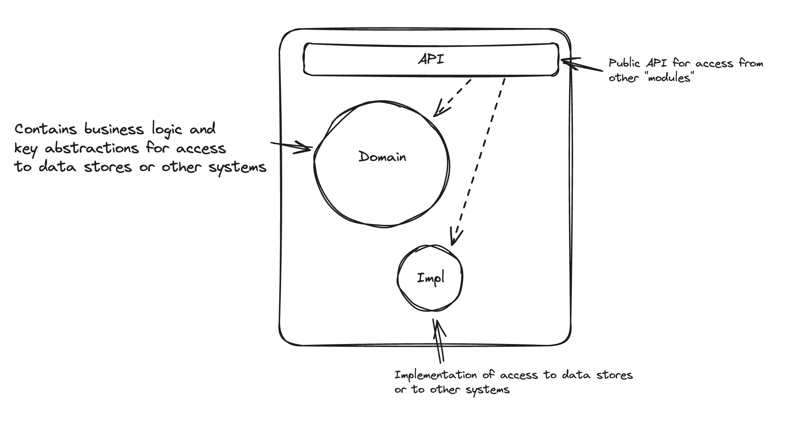

# Java experiments

> This is a Work In Progress and a playground for Java experiments (do not copy, I have very dated experience with Java).

Experiments with Java observability and modules.

## Features

- [x] Send metrics to Datadog. Details in [Metrics](#metrics).
- [ ] Modular design. Details in [Modules](#modules).
- [ ] (maybe)Tests. Details in [Tests](#tests).

### Metrics

The application sends metrics to Datadog. The metrics are sent using the [Java DogStatsD Client](https://github.com/DataDog/java-dogstatsd-client)

The metrics are sent to the Datadog agent running on the host machine. The agent is configured to send the metrics to Datadog. You can find more details about the agent in the [Datadog Agent documentation](https://docs.datadoghq.com/agent/). You can download a preconfigured agent from [here](https://app.datadoghq.eu/account/settings/agent/latest?platform=overview).

Uses conventions from [here](https://devonburriss.me/telemetry-tips/)

One important part of using metrics is to build up tooling that allows developers to fall into the pit of success. The implementation here shows a few things:

- makes it easy to set up telemetry
- enforcing naming conventions for tags and metrics
- makes it easy to creat domain specific, declarative APIs for sending metrics and logs

Uses design outlined here [here](https://www.erikheemskerk.nl/meaningful-logging-and-metrics/)

> A suggestion was made to use [Micrometer](https://micrometer.io/) interface instead of the Metrics abstact class.

The important part here is that the `MonitoringEvents` treats telemetry as a single concern. We can send metrics and logs. And we may change what we send over time. We want this to have as little impact on our application code as possible. We can take this one step further by having a class that uses `MonitoringEvents` but its API is domain specific and declarative. We tell it what happened and it decides what to send. This way we can change what we send without changing the application code. See `JavaDemoObservability` for an example.

### Modules

The idea is to experiment with using Spring Modulith together with Clean Architecture design (Onion/Hexagonal/Ports & Adapters). 

### Tests

I would like to demo good use of unit and integration tests. The idea is that tests should have as little knowledge about the internals of the application as possible. The further the test is from the code it is testing, the less it should know.

3 types of tests will be used:

- Acceptance tests: Does my application behave as expected? Can I deploy it? 
They need not be end-to-end tests, but they should be close to the end user. They should not know about the internal structure of the application. They can be unit tests, integration tests or a mix of both. They need not use a Gherkin, unless they are being co-developed with a non-technical person.

- Building tests: Does this code behave as I expect? Is this API ergonomic to use? 
These are the low level unit tests that are used when building the application. They should be close to the code they are testing. Typically, they are unit tests and are written while TDDing the code. They give instant feedback to the developer on whether the code is working as expected. These tests usually know a lot about the internals of what they are testing, and so can inhibit refactoring. They import parts of the behaviour should be covered by other types of tests so that these tests can be deleted if they get in the way of refactoring.

- Communication tests: 
Can there parts understand each other? Can this SQL run? Am I honouring the contract with an application that depends on me?
These tests test whether the application is communicating with other applications correctly. They are typically focused on a particualar language of protocol.